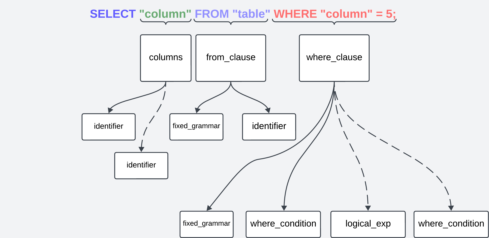

# SQL Parser Project

This is a simple project to parse SQL queries using `pest` crate.\
Currently parser supports simple `select` queries whith where conditions.

## Project Description

The `SQL Query Parser` extracts from a basic SQL query:
- **Table Name**: The table from which data is selected.
- **Columns**: List of columns specified in the query.

## Technical overview

Created parser processes PSQL-like `select` statements with multiple columns selections and where statements.
Column and table names have to be encased in double quotes, while string values have to be encased in single quotes.
Reserved keywords have to 

There are main grammar rules used:
- `query`: Matches the full SQL `SELECT` statement.
- `columns`: Parses a comma-separated list of columns.
- `from_clause`: Parses the `FROM TABLE` part of statement.
- `where_clause`: Parses the `WHERE CONDITION` part of statement.
- `identifier`: Parses the name of a column or table.



## Links
[docs](https://docs.rs/sql_query_parser/latest/sql_query_parser/)

[crate](https://crates.io/crates/sql_parser_project)

## Example Usage

```
cargo run test-query.txt
```

## Example query
```postgresql
SELECT "column1" FROM "table" WHERE "column1" = 5 AND "column2" = 'value';
```

## Example output
```
Selected table: "table"
Selected columns: "column1"
Conditions:
  Column: "column1", Operator: =, Value: 5
   AND 
  Column: "column2", Operator: =, Value: 'value'

```
